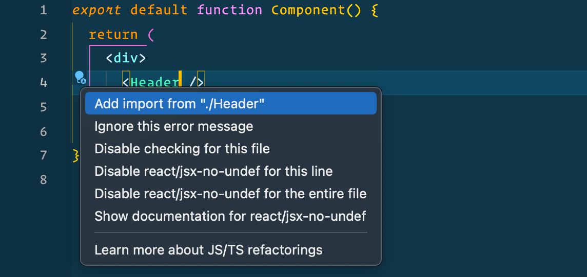

## Auto-import problems

If you work on JavaScript projects in VS Code, you've almost certainly been frustrated with the hit-or-miss nature of the auto-import suggestions. When you try to import code from elsewhere in your project, the correct suggestion is nowhere to be found.


There are extensions to help with this, but it turns out VS Code now handles this natively – using the `jsconfig.json` file – and luckily it's very simple to setup.

## Create the `jsconfig.json` file

As of 2018, VS Code treats all JS files as separate from one another. In order to tell it that your files are all part of an **Explicit Project**, you need to create and configure a `jsconfig.json` file (this is a descendant of `tsconfig.json`, which is required for TypeScript projects).

Here's how:
1. Create the `jsconfig.json` file at the root of your project.
2. (Optional) Configure the compiler options.

Technically an empty file will suffice to tell VS Code this is a project, but you'll likely want to
configure a few things.

There's a lot of options that can be set, but a few that I like to set for React projects are:
```js
// jsconfig.json at project root

{
  "compilerOptions": {
    "module": "ES6",
    "jsx": "preserve",
    "checkJs": true
  },
  "exclude": ["node_modules", "**/node_modules/*"]
}
```

[See the docs](https://code.visualstudio.com/docs/languages/jsconfig) for details and more config settings.

## And it works! 👍

Now that VS Code knows to treat all your JS files as an explicit project, auto-import suggestions will populate with all your relevant exported code.


Hope that helps!