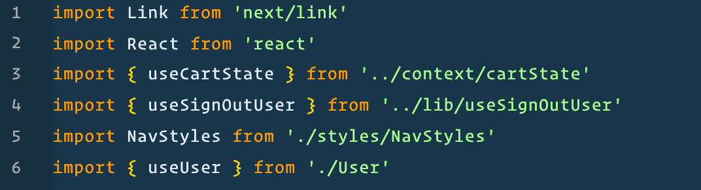
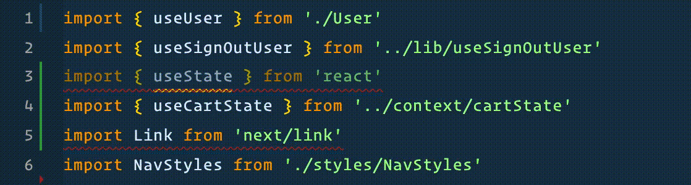

There's a VS Code setting that enables automatic organizing of imports on file saves.

It primarily does two things: sorts imports based on ESLint settings, and removes any unused imports. Aside from being a timesaver, this also avoids linting errors (which is especially useful in CI/CD codebases where linting errors will stop a job from completing).

What's great is you can set it in your user or project settings and forget about it, and it's only a couple lines.

```js
// settings.json

{
  // put this in your settings object
  "editor.codeActionsOnSave": {
      "source.organizeImports": true,
    },
}
```

And that's it! Now when you save, your imports magically sort themselves out!


