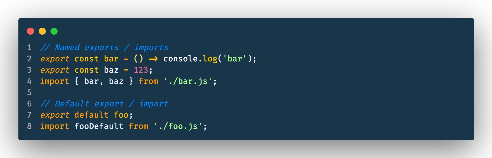

JavaScript Modules using ES6 syntax have two different types of exports: **named** and **default**.

There are differences in how they are declared as well as how they are imported.

## Named Exports

Named exports can be used to export several variables from a module. The `export` keyword can be used for each variable that you want to export. When importing, you use [object destructuring](https://developer.mozilla.org/en-US/docs/Web/JavaScript/Reference/Operators/Destructuring_assignment) to assign the exported variables. The imported variables must use the same name as the exports.

```js
// foo.js

export const foo = () => {
  console.log("foo");
}

export const bar = 123;
```

`foo.js` has two named exports, `foo` and `bar`, which can be imported from any other JavaScript file like:

```js
// anotherComponent.js

// import the foo and bar named exports from foo.js
import { foo, bar } from "./foo";

// both variables can now be used
foo(); // logs 'foo' to the console
console.log(bar); // logs the number 123 to the console
```

- Named exports can be used to export and import several variables from a module.
- **When using named exports, the imported variables must use the same name as the exported variables.**
- If you want to rename imported variables, you can use the `as` keyword:

  ```js
  import { foo as myVariable, bar } from "./foo";

  myVariable(); // logs 'foo' to the console
  ```

## Default Exports

You can only have one default export in a module. You use the `default` keyword to specify which variable is the default export. When importing default exports, any name can be used for variable assignment.

```js
// baz.js

const baz = () => {
  console.log("baz");
}

export default baz;
```

Now that `baz.js` has defined its default export, any other JavaScript file can import and use the `baz` variable by importing as so:

```js
// anotherComponent.js

// import the default export from baz.js
import bazDefault from "./baz";

// the imported variable can now be used
bazDefault(); // logs 'baz' to the console
```

We've successfully imported `baz` into a variable called `bazDefault`.

- **Each module can only have one default export**.
- You define the default export using the `default` keyword.
- When using default exports, we can choose any name for the variable we import into. I chose `bazDefault`, but could have just as easily called it `baz`, `someVariable`, or `apples` and it would have been perfectly valid.

## Summary

So that's it, the differences between named and default exports in ES6 and how they are used.

Key points:

- Modules can have several named exports, but only one default export.
- When importing, named exports must use the same name, while default exports can be imported to any name.
