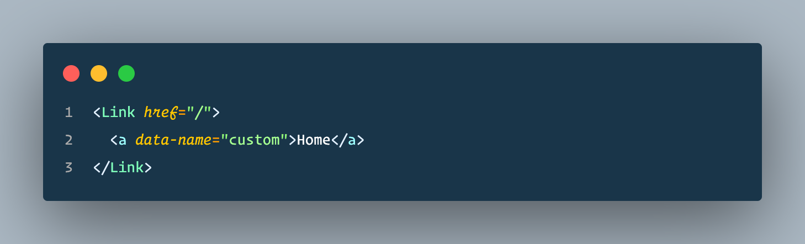

Next.js provides a nifty little `Link` component, which allows internal linking within your React application without causing a page refresh.

```jsx
<Link href="/">Home</Link>
```

While this works great, there are situations where you want to pass additional attributes to your anchor tag, such as `aria` attributes or custom `data` attributes.

Since `Link` is a React component and expects specific props to be passed, you can't simply pass in the attributes as props to the `Link` component.

```jsx
// This doesn't work, the rendered anchor tag ignores
// the additional attribute
<Link href="/" data-name="custom">Home</Link>
```

Lucky for us, Next provides a simple solution to this:

```jsx
<Link href="/">
  <a data-name="custom">Home</a>
</Link>
```

Note: It's important that your `href` stay as a prop in `Link` rather than an attribute in the anchor tag.

This renders out to `<a href="/" data-name="custom">Home</a>` in the DOM and maintains the internal linking speediness we love about Next!