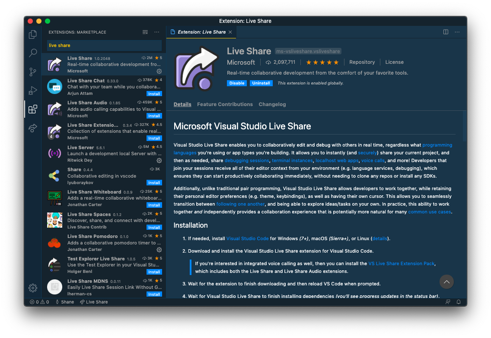
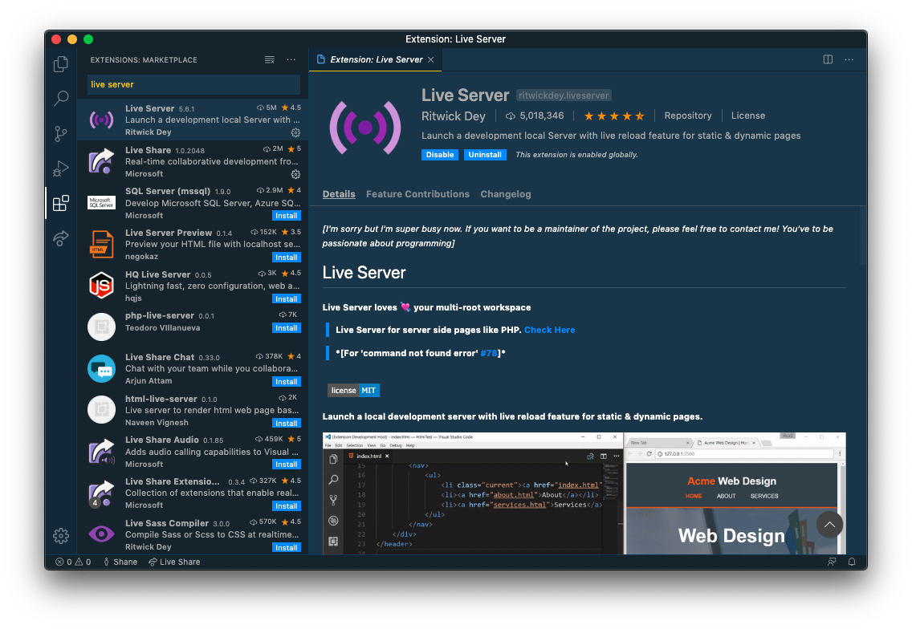
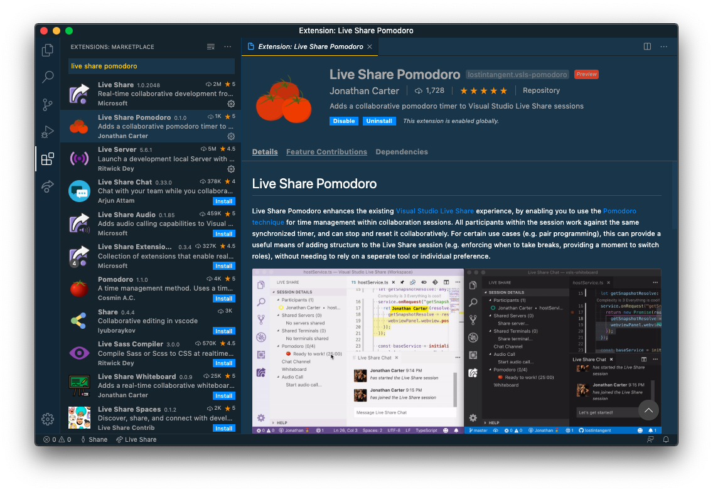
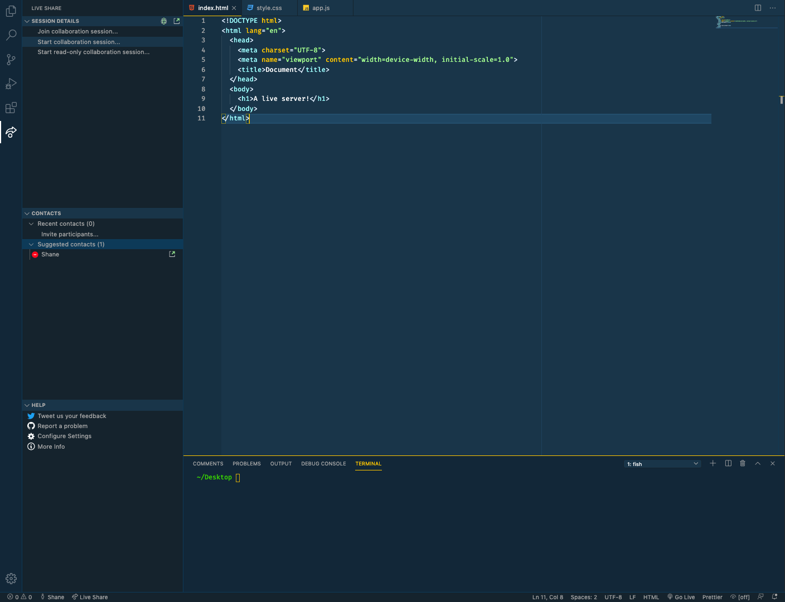
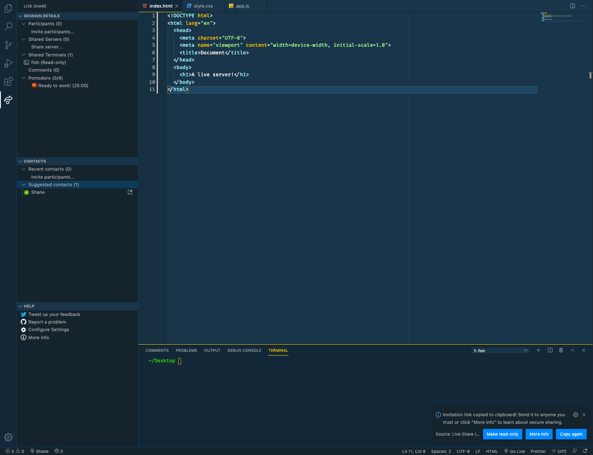
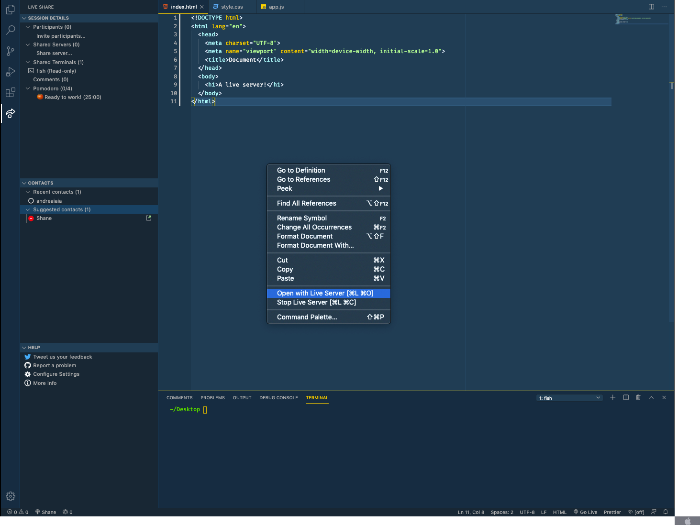
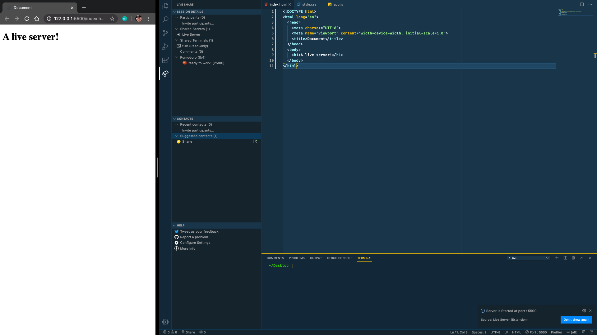

Pair programming – two programmers working together on one workstation at the same time – is easy enough to do when both people are sitting at the same computer. But when attempting to pair program remotely, there is a little bit of setup required to get an effective workspace. Fortunately, if both programmers are using Visual Studio Code, it is easy to setup using a few great extensions – [Live Share][live_share], [Live Server][live_server], and [Live Share Pomodoro][ls_pomodoro].

## Background
As part of the curriculum for [The Odin Project](https://www.theodinproject.com), I am currently working on an assignment to create a Pomodoro Timer application. But, the real purpose of the project is to introduce the students to pair programming. And seeing that the course is all online, the first step (after finding a partner) is setting up the workspace to replicate in-person pair programming.

I use VS Code, and lucky for me Microsoft has developed the Live Share extension that allows collaborative coding on a hosts local files to all invited participants. This, coupled with a couple other extensions, makes for a very effective pair programming environment, which should be as effective as in-person pairs.

## Setup
If you don't already have VS Code installed, [download and install](https://code.visualstudio.com/download) for your operating system.

> **Important Note:**
> VS Code and the extensions must be installed on both programmers computers in order to be used together.

### Install Extensions

You'll need to install two extensions, and one optional extension. Open up VS Code, navigate to the Extensions tab, then search for and install the following (alternatively just open the links and install from the browser):

1. [Live Share](live_share)

1. [Live Server](liveserver)

1. [Live Share Pomodoro](ls_pomodoro) (_Optional_)

With these extensions installed, close and reopen VS Code.
You're now ready to start the Live Share server.

## Hosting and Collaborating

There's a few steps to take, but once it's setup you will be ready to collaborate!

1. Open VS Code and a new Workspace.

1. Open the Live Share tab, and click **Start collaboration session...**

   

1. This should create a Live Share server and copy a link to your clipboard. This can now be shared with your programming partner and will allow them to join.

   

1. With your index HTML file open, right-click in the editor window and select **Open with Live Server**.

   

   This will launch a local version of the HTML file in your browser, and _also_ create a shared server that your partner can click to load the file in their browser (look for **Live Server** in the **Shared Server** dropdown).

   Any changes that are saved to this file will update the browser view for both you _and_ your partner. Pretty rad!

   

## Wrap Up

In only a few minutes you can have a really nice pair programming environment setup for you and your partner(s).

What's great about this setup is that you can see live code updates as your buddy codes along, and see the HTML page reflect the changes even if the file is not local to your computer! No need to constantly push and pull from GitHub.

I also find the installed Pomodoro Timer extension to be really useful. If you both have this installed, you can start a 25min timer that is great for switching roles between driving and navigating.

There is also built in voice chat within Live Share, however I have not used that feature. But great to know that it has all the tools you need in one clean package!

[live_share]: https://marketplace.visualstudio.com/items?itemName=MS-vsliveshare.vsliveshare
[live_server]: https://marketplace.visualstudio.com/items?itemName=ritwickdey.LiveServer
[ls_pomodoro]: https://marketplace.visualstudio.com/items?itemName=lostintangent.vsls-pomodoro